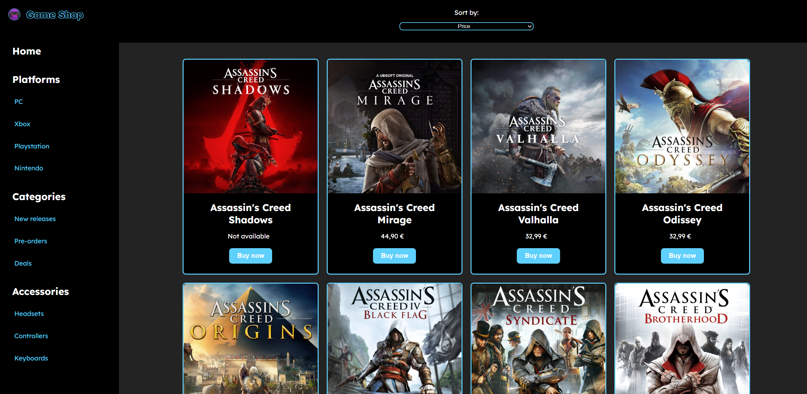

# Responsive Layout for Video Game E-Commerce
This repository contains the code for a responsive online video game store layout. Developed as part of a coding bootcamp assignment, the project demonstrates the use of media queries to adapt the user interface for different screen sizes, enhancing user experience on both desktop and mobile devices.

## Features
- **Web Version Layout:**
  - Left sidebar with navigation menu and footer
  - Central section for filters and available games
  - Pagination for easy navigation through multiple pages

- **Mobile Version Layout:**
  - Menu with Hamburger Icon
  - Central section displaying games
  - Pagination 
  - Footer
 
## Preview

